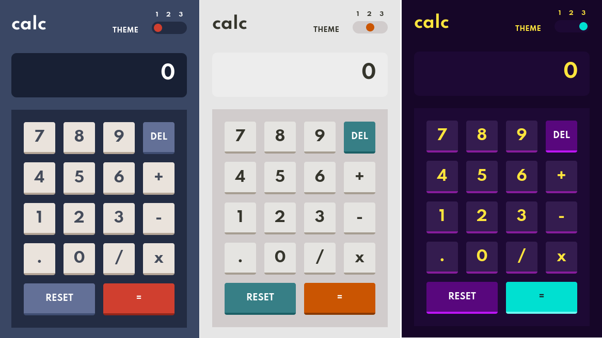

# Frontend Mentor - Calculator app solution

This is a solution to the [Calculator app challenge on Frontend Mentor](https://www.frontendmentor.io/challenges/calculator-app-9lteq5N29). Frontend Mentor challenges help you improve your coding skills by building realistic projects.

## Table of contents

- [Overview](#overview)
  - [The challenge](#the-challenge)
  - [Screenshot](#screenshot)
  - [Links](#links)
- [My process](#my-process)
  - [Built with](#built-with)
  - [What I learned](#what-i-learned)
  - [Useful resources](#useful-resources)
- [Author](#author)

**Note: Delete this note and update the table of contents based on what sections you keep.**

## Overview

### The challenge

Users should be able to:

- See the size of the elements adjust based on their device's screen size
- Perform mathmatical operations like addition, subtraction, multiplication, and division
- Adjust the color theme based on their preference
- **Bonus**: Have their initial theme preference checked using `prefers-color-scheme` and have any additional changes saved in the browser

### Screenshot

### Links

- Solution URL: [GitHub](https://github.com/hectorgarcia07/FEM-Calculator-App)
- Live Site URL: [GitHub Pages](https://hectorgarcia07.github.io/FEM-Calculator-App/)

## My process

### Built with

- Semantic HTML5 markup
- CSS custom properties
- Flexbox
- CSS Grid
- Mobile-first workflow
- SCSS
- Javascript

### What I learned

Managed to further exercise my skill-set and encounterned many problems in which I learned from.
I managed to make make a custom radio theme switcher that's also accessible. Learned about
object oritented programming which is what the Calculator functionality is based on, and further
practice my SCSS.

### Useful resources

- [Creating custom 3 switch radio button](https://dev.to/sanaz/tristate-toggle-switch-509n) - A struggle that I had was implementing a custom radio button that would allow me to easily switch between
  themes. His solution helped, only issue that I had was that it wasn't accessible via the tab key.

- [Accessible custom radio buttons](https://www.a11ywithlindsey.com/blog/create-custom-keyboard-accessible-radio-buttons) - This blog helped me actually make a custom radio button that is accessable via the tab key.

- [Creating the calculator logic](https://github.com/WebDevSimplified/Vanilla-JavaScript-Calculator) - WebDev Simplified implementation served as a building block to helped me figure out how to structure the logic and operations that the calculator should have.

- [How to structure SASS](https://www.webdesignerdepot.com/2020/12/2-smartest-ways-to-structure-sass/) - As the title mentions, I found it a bit overwhelming trying to figure out how to structure several SASS files and this source helped me out.

- [How to switch themes](https://medium.com/swlh/dark-mode-using-css-variables-cf065a7fa133) - I was wondering a theme switcher would work and this article provided a good explenation on how to do it and also how to save the users theme on localstorage.

## Author

- [Github](https://github.com/hectorgarcia07)

- Frontend Mentor - [@hectorgarcia07](https://www.frontendmentor.io/profile/hectorgarcia07)
